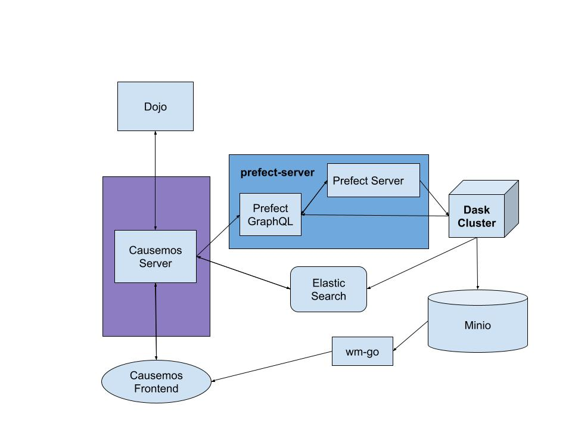

# Dojo to Causemos data pipeline

## Setup

From a suitable virtual environment (venv, conda, etc.), dependencies for local development can be installed by running
```
pip install -e .
```
or
```
conda develop .
```
(see this [issue](https://github.com/conda/conda-build/issues/1992) for uncertainty surrounding the conda command).

---

## Setup Code Formatting

This repo uses [black](https://black.readthedocs.io/en/stable/index.html). You can install it with `pip install black`. Once installed, you can configure it in your IDE with the instructions [here](https://black.readthedocs.io/en/stable/integrations/editors.html).  
In VS Code, you simply need to add the folowing lines into `settings.json`
```
    "python.formatting.provider": "black",
    "python.formatting.blackArgs": []
```

You can apply formatting rules to the current document with `Format Document` (Option + Shift + F) or to all files by running `black .` from the repo root.

---

## Setup Linting

The Gitlab CI pipeline uses `mypy`. You can install it with `pip install mypy`.  
After installing, you will need to download type definitions using `mypy --install-types`.  
In VS Code, you can configure it with the `Python: Select Linter` action.  

---

## Development

For development, flows can be run locally with no requirement for access to a Prefect server or agent, and no Dask cluster instance (an in-process temporary cluster is started by the prefect Dask executor).  The [run_local.sh](./flows/run_local.sh) script provides an example of the environment configuration and execution command to required to run in such a context.  A small amount of boilerplate needs to be added a flow to support this, as can be seen in [dask_flow_test.py](./flows/dask_flow_test.py)

If a cluster is required for performance reasons, but there is no need for full execution in the Prefect infrastructure, the `WM_DASK_SCHEDULER` environment variable can be set to point to an available Dask cluster.  This can be the instance on the docker swarm, or a local docker instance launched by running `docker-compose up` in the `dask` directory.

To validate Prefect execution outside of the deployment environment, a prefect server can be started by running [infra/prefect/start_server.sh](./infra/prefect/start_server.sh), and a docker agent can be started by running [infra/prefect/start_agent_local.sh](./infra/prefect/start_agent_local.sh).  Flows can then be registered as described in the [prefect setup](./infra/prefect/setup.md).  The scripts assume that a Dask cluster will be running locally in this context.

---

## Deployment

To deploy the datacube pipeline to the production Prefect environment run [flows/scripts/build_and_update.sh](./flows/scripts/build_and_update.sh)  
This assumes you have SSH access to both dask swarms. The script does the following steps:

1. Re-build the base docker image by running [infra/docker/docker_build.sh](./infra/docker/docker_build.sh)
2. Push the base image [infra/docker/docker_push.sh](./infra/docker/docker_push.sh)
3. Register flows by running [flows/prefect/register_flows.sh](./flows/prefect/register_flows.sh) or executing similar commands for individual flows.
4. Log into the Dask swarm and restart with the updated image (see [here](./infra/dask/setup.md))

---

## Running Jupyter Lab

Start `jupyter lab`

---

## Infrastructure

See [here](./infra/README.md) how to set up a dask cluster and prefect server.
## Prefect Flow Development

See [here](./flows/README.md) for an overview of how to develop flows for the Prefect environment.

---


