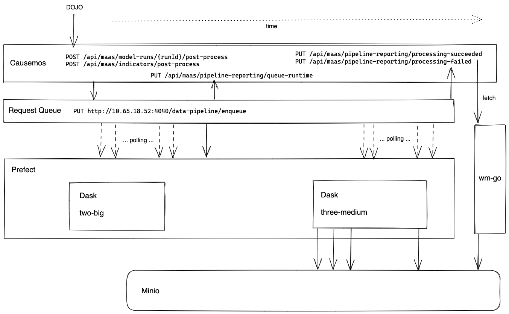

# Dojo to Causemos data pipeline

## Setup
### Python Version
The pipeline is tested and deployed with **Python 3.8.5**. While small differences to the patch version should work there are some dependencies with known issues on versions other than 3.8.*.

### Environment
From a suitable virtual environment (venv, conda, etc.), dependencies for local development can be installed by running
```
pip install -e .
prefect backend server
```
---

## Setup Code Formatting

This repo uses [black](https://black.readthedocs.io/en/stable/index.html). You can install it with `pip install black==21.9b0`. Once installed, you can configure it in your IDE with the instructions [here](https://black.readthedocs.io/en/stable/integrations/editors.html).  
In VS Code, you simply need to add the folowing lines into `settings.json`
```
    "python.formatting.provider": "black",
    "python.formatting.blackArgs": []
```

You can apply formatting rules to the current document with `Format Document` (Option + Shift + F) or to all files by running `black .` from the repo root.

---

## Setup Linting

The Gitlab CI pipeline uses `mypy`. You can install it with `pip install mypy==0.910`.  
After installing, you will need to download type definitions using `mypy --install-types`.  
In VS Code, you can configure it with the `Python: Select Linter` action.  

---

## Development
This will locally run the `flow.run` configurations at the bottom of [data_pipeline.py](./flows/data_pipeline.py). The results are written to minio-dev. See the folder structure [here](./doc/minio-folder-structure.md).
```
cd flows
./run_local.sh
```

For development, flows can be run locally with no requirement for access to a Prefect server or agent, and no Dask cluster instance (an in-process temporary cluster is started by the prefect Dask executor).  The [run_local.sh](./flows/run_local.sh) script provides an example of the environment configuration and execution command to required to run in such a context.  A small amount of boilerplate needs to be added a flow to support this, as can be seen in [dask_flow_test.py](./flows/dask_flow_test.py)

If a cluster is required for performance reasons, but there is no need for full execution in the Prefect infrastructure, the `WM_DASK_SCHEDULER` environment variable can be set to point to an available Dask cluster.  This can be the instance on the docker swarm, or a local docker instance launched by running `docker-compose up` in the `dask` directory.

To validate Prefect execution outside of the deployment environment, a prefect server can be started by running [infra/prefect/start_server.sh](./infra/prefect/start_server.sh), and a docker agent can be started by running [infra/prefect/start_agent_local.sh](./infra/prefect/start_agent_local.sh).  Flows can then be registered as described in the [prefect setup](./infra/prefect/setup.md).  The scripts assume that a Dask cluster will be running locally in this context.

### Notes on Dask development
- Dask is lazy evaluated. Operations are only evaluated when `.compte()` is called.
- In order to `print()` a dataframe you will need to `compute` it or use `print(df.head())`.
- It's easy to write extremely slow code in Dask, stick to vectorized operations and built-in aggregations.
- When working with larger data consider removing parts of the flow that aren't necessary for your work. For example, remove tiling, or the entire annual part of the pipeline. 
---

## Developing using Jupyter Notebooks
Some find it preferable to work on the data pipeline by using Jupyter Notebooks. The functions in [flows/common.py](./flows/common.py) can be used directly, however the code in [flows/data_pipeline.py](./flows/dat_pipeline.py) requires Prefect which cannot be used inside Notebooks.  
For best results, add the dependencies for jupyter and start `jupyter lab`.  
See some of the existing notebooks used to develop previous features in the [notebooks](./notebooks/) directory

---

## Deployment

To deploy the datacube pipeline to the production Prefect environment run [deploy/build_and_update.sh](./deploy/build_and_update.sh)
```
cd ./deploy
./build_and_update.sh
```
**NOTES:**
- **This script will kill the Dask swarms and any running jobs. Before running, you should verify that there are no jobs running.**
- This script assumes:
  - You have SSH access to both dask swarms, with some required entries in your `~/.ssh/config`.
  - The Prefect tooling was configured with `prefect backed server` 

The script does the following steps:

1. Stop the request-queue
1. Stop both Dask swarms
1. Re-build the base docker image by running [infra/docker/docker_build.sh](./infra/docker/docker_build.sh)
1. Push the base image [infra/docker/docker_push.sh](./infra/docker/docker_push.sh)
1. Log into the Dask swarm and restart with the updated image (see [here](./infra/dask/setup.md))
1. Register flows by running [infra/prefect/register_flows.sh](./infra/prefect/register_flows.sh) or executing similar commands for individual flows.
1. Start the request-queue

---

## Infrastructure

See [here](./infra/README.md) how to set up a dask cluster and prefect server.

---


